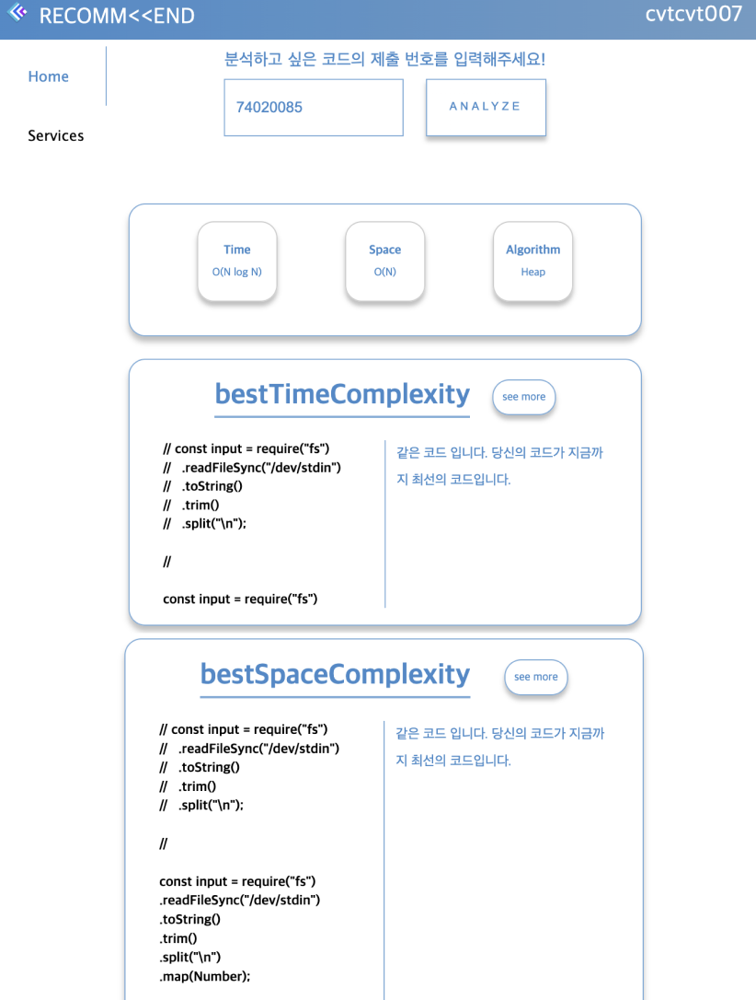
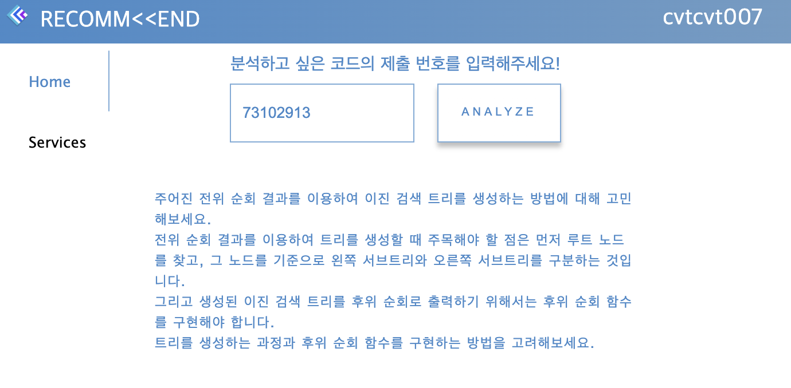
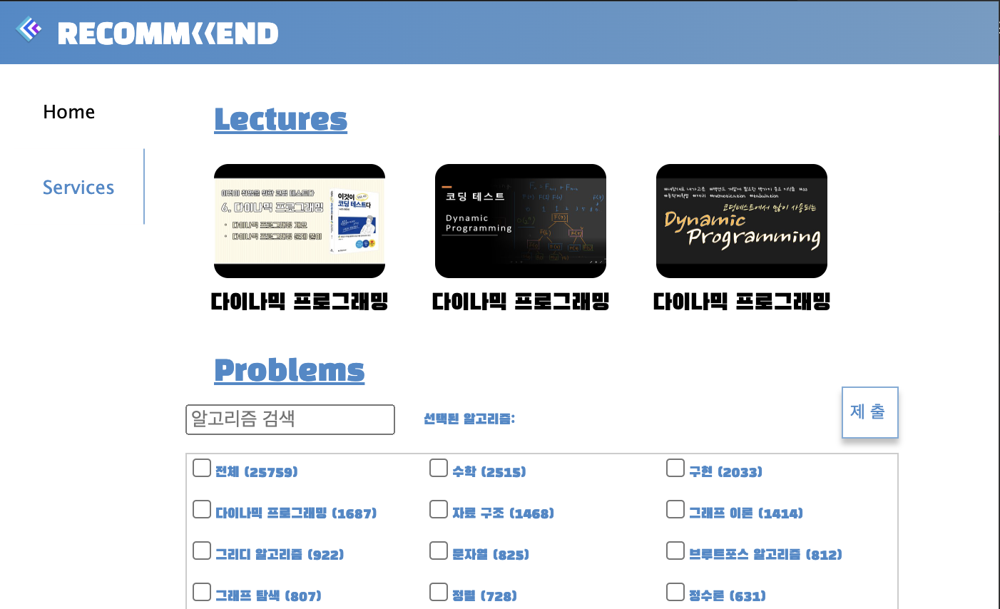

     

 

<h1 align="center">RECOMM&lt;&lt;END</h1>

 

## Contributors

<table align="center">
 <tr>
    <td align="center"></td>
    <td align="center"></td>    
    <td align="center"></td>    
    <td align="center"></td>
  </tr>
  <tr>
    <td align="center"><a href="https://github.com/seunghyun0522"><b>seunghyun0522</b></a></td>
    <td align="center"><a href="https://github.com/trankill1127"><b>gywls20</b></a></td>
    <td align="center"><a href="https://github.com/jeli01"><b>whgek506</b></a></td>
    <td align="center"><a href="https://github.com/llsy159"><b>gyuchanlee</b></a></td>

  </tr>
</table>

## Contents

- [Contributors](#contributors)
- [Contents](#contents)
- [RECOMM\<\<END](#recommend)
- [Function](#function)
  - [Code Analysis](#code-analysis)
  - [Provides code improvement hints](#provides-code-improvement-hints)
  - [YouTube lecture recommendation](#youtube-lecture-recommendation)
  - [Problem Recommendation (Random / Algorithm)](#problem-recommendation-random--algorithm)

## RECOMM&lt;&lt;END

Recommand is a Chrome extension program that aims to help you prepare for coding tests with Baekjun more efficiently 😃 

## Function

- Code Analysis
- Provides code improvement hints
- YouTube lecture recommendation
- Problem Recommendation (Random / Algorithm)

### Code Analysis

 

 

You can use this function by entering the submission number of the code that received the result [맞았습니다!!] and clicking the ANALYZE button.
You can see three pieces of information in order.

- Time complexity, space complexity, what algorithm was used
- Better code in terms of time complexity than user code, and the difference between that code and user code
- Better than the user code in terms of space complexity, and the difference between the code and the user code

### Provides code improvement hints

 

 

You can use this function by entering the submission number of the code that received the result [틀렸습니다] and clicking the ANALYZE button.
It provides hints to improve your code.

### YouTube lecture recommendation

 

 

It analyzes the user's vulnerable algorithms and recommends YouTube lectures that can complement that part.

### Problem Recommendation (Random / Algorithm)

- Random

  If you don't select anything, you can get a random recommendation of the problem.

- Algorithm

  You can choose the algorithm you want and get recommendations for problems that fit that type.
  For example, if you check math and implementation, you can get a recommendation for a problem that includes both math and implementation.
