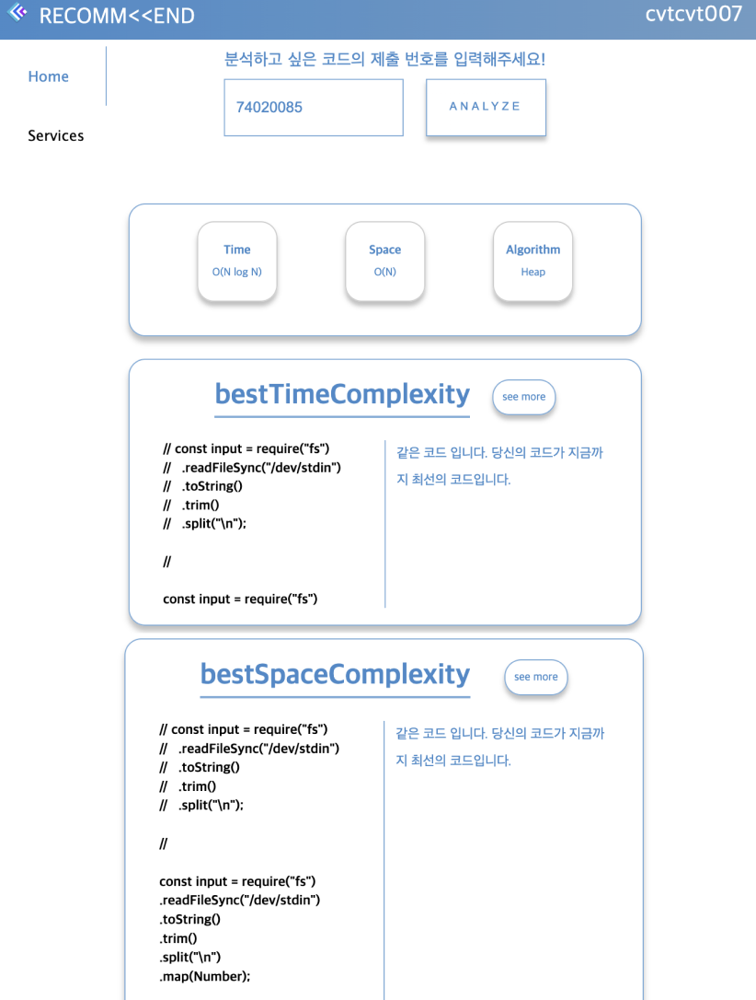
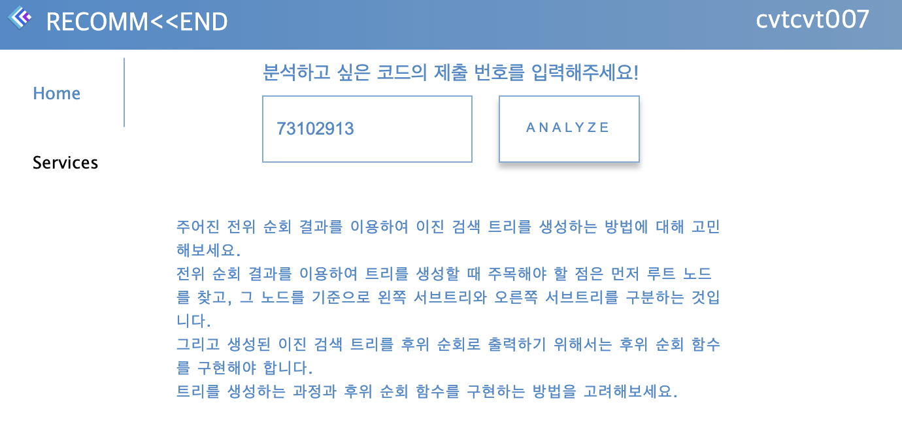
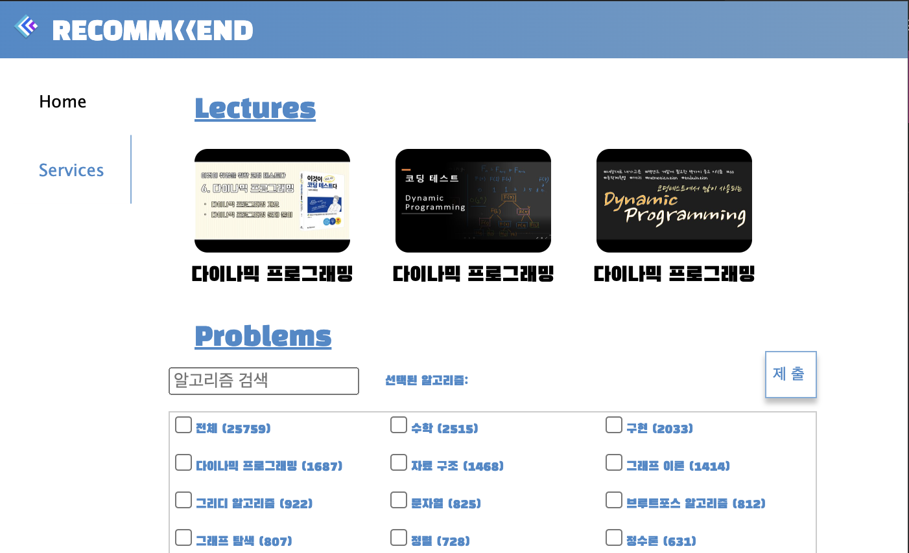

     

 
<h1 align="center">RECOMM&lt;&lt;END</h1>
 

## 기여자
<table align="center">
 <tr>
    <td align="center"></td>
    <td align="center"></td>    
    <td align="center"></td>    
    <td align="center"></td>
  </tr>
  <tr>
    <td align="center"><a href="https://github.com/seunghyun0522"><b>seunghyun0522</b></a></td>
    <td align="center"><a href="https://github.com/trankill1127"><b>gywls20</b></a></td>
    <td align="center"><a href="https://github.com/jeli01"><b>jeli01</b></a></td>
    <td align="center"><a href="https://github.com/llsy159"><b>llsy159</b></a></td>
  </tr>
</table>

## ✏️ 목차
- RECOMM\<\<END 소개
- 주요 기능
  - 코드 분석
  - 코드 개선 힌트 제공
  - 유튜브 강의 추천
  - 문제 추천 (랜덤 / 알고리즘별)

 

## ✏️ RECOMM&lt;&lt;END 소개

RECOMM&lt;&lt;END는 백준으로 코딩 테스트를 더 효율적으로 준비할 수 있도록 도움을 주는 Chrome 확장 프로그램입니다 😃 

## ✏️ 주요 기능

### 1️⃣ 코드 분석
 

 

[맞았습니다!!] 결과를 받은 코드의 제출 번호를 입력하고 ANALYZE 버튼을 클릭하면 이 기능을 사용할 수 있습니다.
다음 세 가지 정보를 순서대로 확인할 수 있습니다.
- 시간 복잡도, 공간 복잡도, 사용된 알고리즘
- 사용자 코드보다 시간 복잡도가 우수한 코드와 그 코드와 사용자 코드의 차이점
- 사용자 코드보다 공간 복잡도가 우수한 코드와 그 코드와 사용자 코드의 차이점

### 2️⃣ 코드 개선 힌트 제공
 

 

[틀렸습니다] 결과를 받은 코드의 제출 번호를 입력하고 ANALYZE 버튼을 클릭하면 이 기능을 사용할 수 있습니다.
코드를 개선할 수 있는 힌트를 제공합니다.

### 3️⃣ 유튜브 강의 추천
 

 

사용자의 취약한 알고리즘을 분석하고 해당 부분을 보완할 수 있는 유튜브 강의를 추천합니다.

### 4️⃣ 문제 추천 (랜덤 / 알고리즘별)
- **랜덤**
  아무것도 선택하지 않으면 문제를 랜덤으로 추천받을 수 있습니다.
  
- **알고리즘별**
  원하는 알고리즘을 선택하여 해당 유형에 맞는 문제 추천을 받을 수 있습니다.
  예를 들어, 수학과 구현을 체크하면 수학과 구현이 모두 포함된 문제를 추천받을 수 있습니다.
